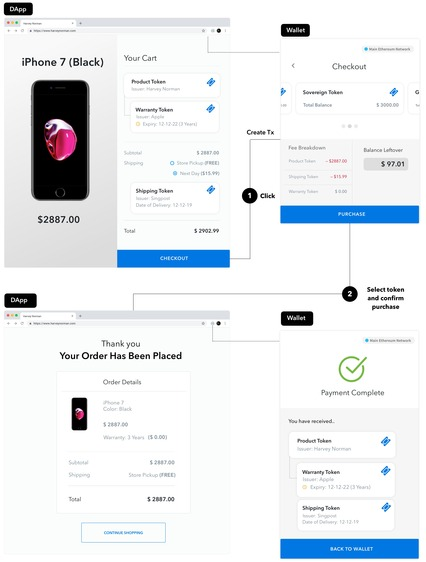
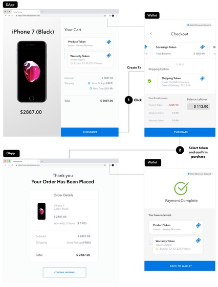

## Acquiring an iPhone

Let's consider a scenario where a user procures an iPhone from Harvey Norman, an online retailer, using blockchain technology. The transaction input would be a form of currency, and the output could potentially be five smart tokens:

- A shipping smart token, which can be redeemed at a local pick-up station to receive the product.

- A warranty smart token, issued by Apple, which enables the iPhone to be serviced at locations other than Harvey Norman (e.g., Apple Centre).

- A receipt smart token, issued by Harvey Norman, which permits the product to be returned within 90 days. It's also useful for obtaining a Tourism Tax Refund if the phone is taken out of Australia.

- A login smart token, which provides access to Apple's App Store, iTunes, and so on.

- An ownership smart token, representing the ownership of the iPhone.

Without smart tokens as the integration anchor, these different services might be carried out through various means, leading to a clutter of papers, order id numbers, links, and so on. With smart tokens, all the user needs is the seed of their wallet and the TokenScript file for the iPhone purchase. Even if they lose their wallet, they can easily restore all necessary information.

This model also simplifies interactions with tax authorities. For instance, if the buyer wants to claim an input tax deduction, they only need to provide their address to the tax authority. If the input tax deduction covers several purchases, they could provide their xpub key, and the tax authority can verify all claimed purchases in seconds without further proof.

### The Shipping Smart Token

In the absence of a smart token, a user might receive a tracking number, which carries no authentication information and cannot be used to pick up the product unless a pickup code is provided, perhaps via SMS - a process that is poorly integrated.

With a shipping smart token, the token status can be remotely updated by the shipping company, even sending notifications to users about an upcoming delivery (if the token is held in a mobile wallet). With some cryptography, it's easy to authorize someone else to pick up a product.

### Warranty Smart Token

Without this smart token, a user might need the serial number and an online registration process to activate the warranty. They might even need to create an account for that, whose password they will probably soon forget.

With a warranty smart token, the terms and expiration are easy to find, as they are token properties. The user can log in to the warranty service website with the token, bypassing the need for an account. The token can be programmed to receive messages like product callbacks or emergency security updates.

### Receipt Smart Token

Without a reliable way to authenticate the purchase, an online purchased product usually cannot be returned to the store but might be returned via online means such as a postback. A smart token carries sufficient authentication methods for the process to be done in store.

Despite such a token not being transferable or authorized, it is still useful for 3rd party integrations. The Tax office will be satisfied that the receipt can't be faked without collaboration from the seller, and allows a swift and easy tax-refund process. If the phone is purchased for work, the employee can easily reclaim the expense from an employer with the trust implied.

### The Login Smart Token

This smart token can be used to log in to an account for Apple's App Store or iTunes shop. It could also be used to synchronize several Apple devices.

### The Ownership Smart Token

This smart token could be needed to use any other token. If the iPhone is sold, the ownership smart token is transferred too, and the old owner will not be able to log in to the account of the new owner. There can also be a mechanism to delete the account history when the ownership smart token is transferred.

As we can see, the use of smart tokens allows for the integration of typically disparate business processes and web experiences. This aligns closely with another benefit of blockchain: a frictionless market. For instance:

- When the phone being traded is second-hand, it would be straightforward to pass the warranty to the next user through a smart token transfer, further opening the market.

- Since shipping can be tokenized, it would be easy for the buyer to choose their preferred shipping company without having to manually supply it with business context (address, product, weight, dates), further opening the market for competition. This is illustrated below.

This example can be further extended to solve complicated and innovative business cases. Suppose the purchase is not made with fiat currency but with American Express points. The iPhone purchase will be insured for screen damage, and as a result, the transaction will also output an insurance smart token.

When the mobile phone is repaired for screen damage, an invoice is issued concerning the purchase record of the phone to prove it is the same phone purchased with the points, enabling the insurance to be paid on the spot.

Without such smart tokens, the user will have to submit a billing statement, invoice, and evidence of repair to submit a claim. Many users will surely miss one of those documents; the claim may take a few days, and still be prone to fraud.

In this insurance case, the blockchain allows for business process innovation that otherwise would require the user to sacrifice convenience, simply because too many parties are involved and there lacks an integration anchor. This is the power of smart tokens in the next-generation web.
