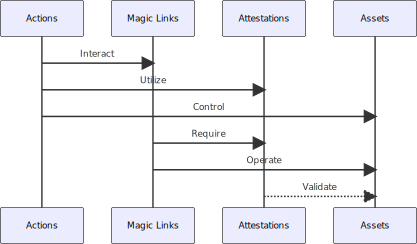

# The Components of TokenScript

TokenScript, when viewed through the lens of smart tokens, presents a more nuanced and comprehensive framework for token interaction and management. This framework is composed of several key components, each playing a distinct role in the overall functionality of the token ecosystem. 

## Actions

Actions in TokenScript are the operations that can be performed with a token. These actions can be broadly classified into three categories:

- Utilizing the token to access a web service
- Employing the token to control IoT devices
- Conducting transactions with the token

For instance, a car token might have actions such as 'Unlock', 'Authorize', and 'Lend', each with its own specific functionality and requirements. Not all actions are inherently provided by the token. Some actions, like 'Transfer', might be provided by a generic token's TokenScript, while others, like 'Auction' or 'List for sharing', might be provided by external entities. 

## Magic Links

Magic links serve as shortcuts to actions on specific assets. They are typically sent to the asset owner and come with the necessary attestations for a transaction, such as an atomic swap. These links streamline the process of performing complex actions, making the user experience more seamless and efficient.

## Attestations

Attestations are akin to tokens, but they are non-transferable. They are essentially cryptographically signed messages that testify something about an object. These attestations can have significant implications for the object they are associated with, affecting its transferability and functionality on the blockchain. Attestations can be seen as a form of asset that validates or verifies something about another asset or entity, adding an extra layer of security and trust to the token ecosystem.

## Assets

In the context of TokenScript, an asset is anything of value that can be owned. This definition is broad and does not necessarily require the asset to produce a return. Assets can be tangible, like a piece of armor in a video game, or intangible, like the right to a bottle of wine. The concept of assets in TokenScript extends beyond the traditional understanding of assets in the financial world, encompassing a wide range of items that hold value in the context of the next-generation web. 

These components together form the backbone of TokenScript, providing a robust and flexible framework for token interaction and management in the era of smart tokens.
