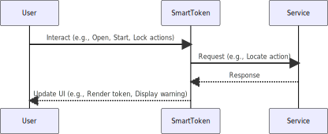

# The Limitations of Traditional Tokens

Early public blockchain projects attempted to implement both token logic and business process into smart contracts. Using an online retail project as an example, such a smart contract would not only process an order but also manage the inventory. The token transaction logic, like under what condition the transaction is valid, is tied with business process, like checking inventory. This method is, naturally, inherited from the way people build websites.

We argue that this method is not suitable for creating a frictionless market and integrating

the next-generation web. Fulfilling the challenges with the conventional token model is difficult, often nearly impossible, while it adds complexity and causing scalability, interoperability and security issues:

**Diversity** 

In the world of Ethereum - the de facto standard for token - diversity of Token is usually created with DApps: The business logic of a token - all kind of applications - are coded in a smart contract, and centralized websites enable users to access the contract. For example, you have an ERC721 crypto kitty token. To use it you must access the cryptokitties website.   
   This method requires the designers to fetch all possible business scenarios before creating the smart contract. As the future is rarely predictable, this method is problematic. It makes it also hard to develop a business model by trial and error. At the same time, it adds a lot of complexity to the code, which often causes security issues. After the DAO was hacked, the Ethereum community restricted itself to only implement relatively limited behavior patterns in smart contracts.    
   So the result is that Token developer need to restrict the scope of diversity, but still add security problems. 

**Integration** 

Ethereum token have a very limited way of interacting with other systems like wallets or dapps. If the logic of interaction is part of the smart contract, we have the problems explained above. *and* must deal with the fact that you hardly can represent all systems language in one contract. It is impossible to do this without the help of external frameworks.    
   Currently this is mostly solved by hosted DApps on websites, which structure the interaction between users and smart contracts. Such DApps have made it possible for users to access relatively advanced smart contracts like CryptoKitties and other token based games. However, this reintroduces the centralization problems Blockchain was made to solve. We will address the problems of hosted DApps soon.       
   A similar problem is the integration in a wallet. Events in the token history must trigger actions in the user interface. It is hard to do this, when the smart contract doesn't define the behaviour of all those systems in a way they understand. It's also hard to do so when a contract is upgraded. The usual solution is, again, to use a hosted DApp instead of a wallet under the user's control.

**Adaptability** 

The inflexibility and immutability of a smart contract tokens makes it hard to develop new protocols for it, especially when those protocols are not known when the contract is written. You will also need your smart contract to interact with other smart contracts in a way you can't predict when designing it.   
   This could end with a locked-in-state of the token on one certain protocol. It could also introduce trusted third parties to migrate to other protocols or to interact with other smart contracts or tokens.     
   On Ethereum, there are methods to upgrade a smart contract. They usually add a lot of complexity to the original smart contract and introduce another smart contracts which performs the upgrade onchain. This approach increases the complexity of the smart contract system, which causes security issues. An example is the multisig contract of Parity, one of the most advanced implementations of Ethereum. Even their developers failed to make the contract secure, resulting in one of the largest losses in the history of Ethereum.

**Trust**

To be used in a wide scope of business activities, Tokens must carry trust relationships. With the legacy token model this casts two problems: First, you will have to input private data on a blockchain, which has, even when encrypted, several risks. Second, you need to carry the relationship over a hosted DApp, which means you are dependent on a website being online. If one part of a chain of trust relationships is offline, your token will

Here's a simplified sequence diagram illustrating the interaction between a user, a smart token, and a service:

