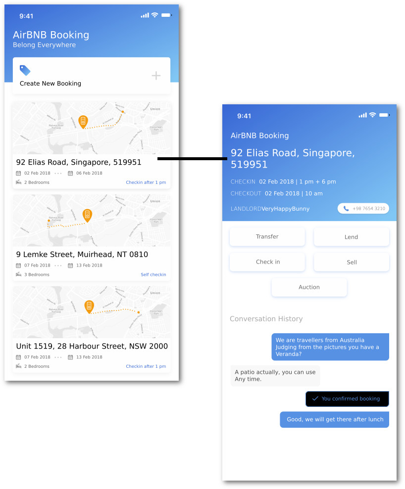

# A Future Iteration of AirBNB

The potential of integration is significantly amplified by the next-generation web and the Internet of Things. Envision a future iteration of AirBNB, where bookings are represented by smart tokens. When a traveller rents an AirBNB property, they receive a smart token, which grants access to the property for a specific duration. Once the duration expires, the smart token essentially becomes void.

The property is secured by a smart-lock, which the traveller can unlock using their smart token. The smart-lock identifies the current holder of the booking smart token. If the property owner prefers additional security, they can request the traveller to provide an identity smart token, which replaces the need for an account on platforms like AirBNB.

If Alice holds a smart token that signifies her right to use a room during a specific timeframe, or "a booking" in layman's terms, she can check-in by either generating a QR code to validate the booking to the landlord or using an NFC-enabled phone to open the smart-lock.

This process doesn't introduce something fundamentally novel, but it streamlines an existing process. Presently, booking a property on AirBNB or similar platforms requires the traveller to create an account on the platform, provide credit card details (or some other form of identity verification), receive an order confirmation and an unlock key via email, among other steps. All these steps can be consolidated into a single smart token.

## Requirements

From the perspective of this desirable integration, we can deduce that TokenScript needs to fulfill the following requirements:

- Enable the definition of token actions. For instance, a shipping token would have a "redeem" action (via a QR code or NFC) and an "authorize" action which would permit someone else to pick up a delivery. In the case of AirBNB, there would be an unlock or verify action.

- Facilitate access to blockchain functions within an action.

- Facilitate access to web functions within an action. Essentially, this implies that both blockchain and web functions must be incorporated into TokenScript, enabling its integration. TokenScript should not only define how a token behaves but also how other environments respond to a token action.

- Enable the update of the token status, via a web API or signed message. The token status could be its validity during a specific timeframe, the extension of this timeframe, and much more (more on that later).
